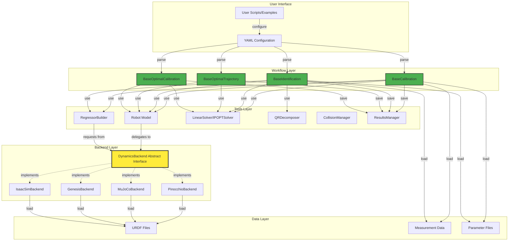
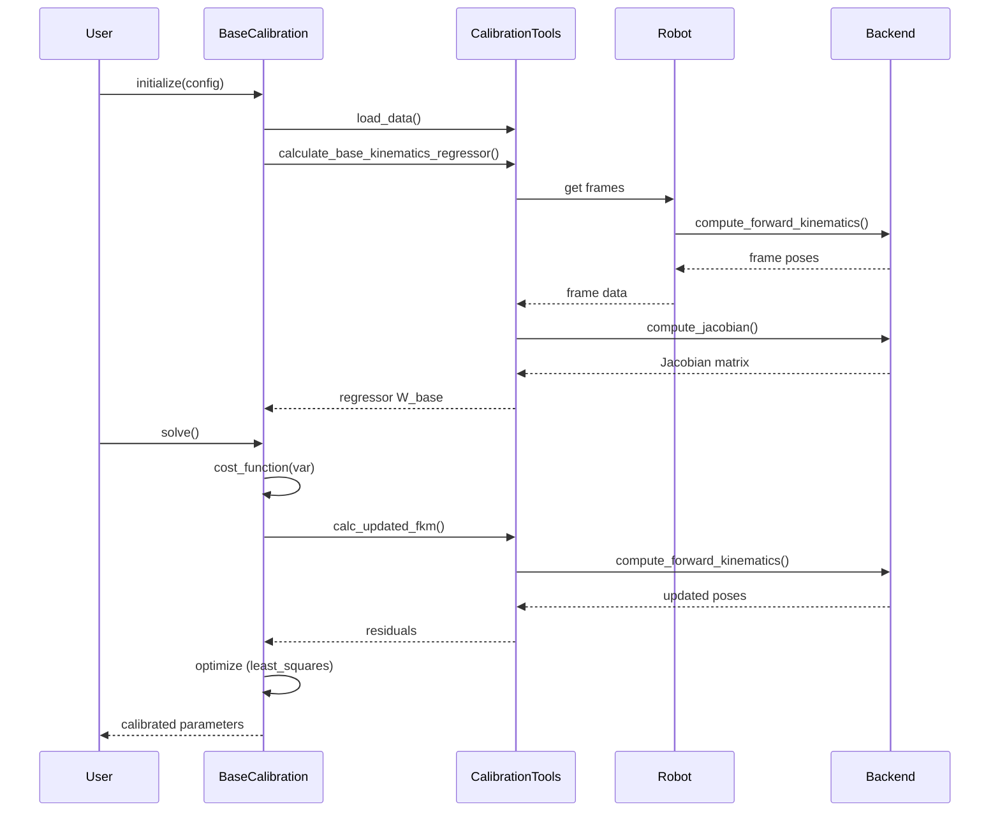
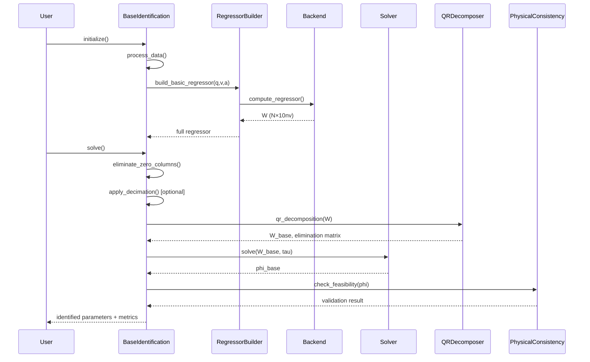
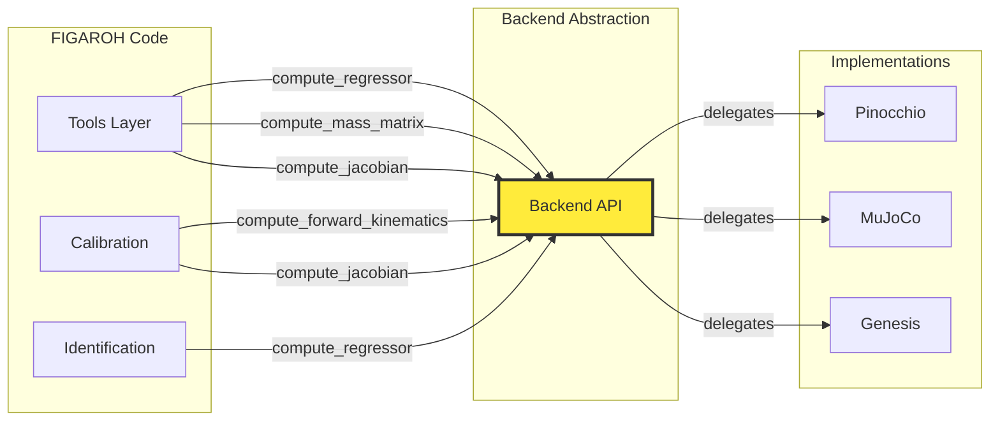
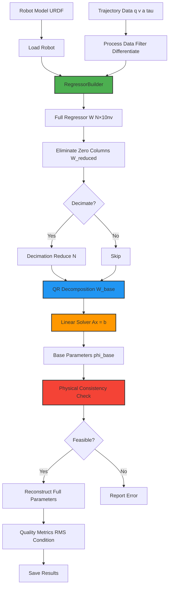
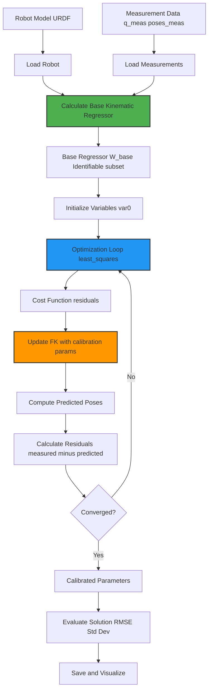

# FIGAROH Architecture Documentation

**Version:** 3.0  
**Date:** June 19, 2026  
**Status:** Backend abstraction functional — identification fully portable, calibration partially portable (model manipulation blocker)

---

## Table of Contents
1. [Executive Summary](#executive-summary)
2. [System Overview](#system-overview)
3. [Layered Architecture](#layered-architecture)
4. [Module Details](#module-details)
5. [Pinocchio Integration Map](#pinocchio-integration-map)
6. [Data Flow](#data-flow)
7. [Backend Architecture](#backend-architecture)
8. [Extension Points](#extension-points)
9. [Performance Considerations](#performance-considerations)

---

## Executive Summary

FIGAROH (Fast Identification of Geometric And Regressor-based Optimization for Humanoids) is a modular framework for robot calibration and parameter identification. The architecture follows a **three-layer design**:

1. **Backend Layer** - Pluggable dynamics computation (Pinocchio, MuJoCo, Genesis, Isaac Sim)
2. **Tools Layer** - Core algorithms (regressor computation, solvers, parameter handling)
3. **Workflow Layer** - High-level orchestration (calibration, identification, optimal trajectory)

### Key Design Principles
- **Simulator Agnostic**: Backend abstraction enables seamless simulator switching
- **Algorithm Consistency**: Same identification/calibration algorithms across all backends
- **Modular & Extensible**: Clear separation of concerns enables easy extension
- **Production Ready**: Comprehensive error handling, validation, and documentation

---

## System Overview

> **📝 Note**: This document contains Mermaid diagrams. If they don't render:
> 1. Install the "Markdown Preview Mermaid Support" extension in VS Code
> 2. View the file on GitHub (renders Mermaid natively)
> 3. Use the online viewer: https://mermaid.live
> 
> Or see the ASCII version below.

### ASCII Architecture Overview

```
┌─────────────────────────────────────────────────────────────────┐
│                        FIGAROH ARCHITECTURE                      │
└─────────────────────────────────────────────────────────────────┘

                    User Scripts/Examples
                    YAML Configuration
                            │
                            ▼
        ┌───────────────────────────────────────────┐
        │         WORKFLOW LAYER                    │
        │  BaseCalibration   BaseIdentification     │
        │  BaseOptimalTrajectory  BaseOptimalCalib  │
        └───────────────────┬───────────────────────┘
                            │
                            ▼
        ┌───────────────────────────────────────────┐
        │           TOOLS LAYER                     │
        │  Robot  RegressorBuilder  LinearSolver    │
        │  QRDecomposer  CollisionManager           │
        └───────────────────┬───────────────────────┘
                            │
                            ▼
        ┌───────────────────────────────────────────┐
        │         BACKEND LAYER                     │
        │    DynamicsBackend (Abstract)             │
        │      │       │        │         │         │
        │  Pinocchio MuJoCo Genesis IsaacSim        │
        └───────────────────┬───────────────────────┘
                            │
                            ▼
                    URDF/MJCF/USD Files
                    Measurement Data
                    Parameter Files
```

**Key Relationships:**
- Workflow → Tools: Use core algorithms
- Tools → Backend: Delegate dynamics computation
- Backend → Data: Load robot models and measurements

### Detailed Mermaid Diagram



---

## Layered Architecture

### Layer 1: Backend Layer (`src/figaroh/backends/`)

**Purpose:** Abstract dynamics computation across simulators

**Components:**
- `base.py` - `DynamicsBackend` abstract interface
- `pinocchio.py` - Pinocchio implementation (default)
- `mujoco.py` - MuJoCo implementation (high-performance)
- `genesis.py` - Genesis implementation (GPU-accelerated) *[Future]*
- `isaacsim.py` - Isaac Sim implementation (sim-to-real) *[Future]*

**Key Interface Methods:**
```python
class DynamicsBackend(ABC):
    @abstractmethod
    def compute_mass_matrix(q: ndarray) -> ndarray
    @abstractmethod
    def compute_coriolis_matrix(q: ndarray, v: ndarray) -> ndarray
    @abstractmethod
    def compute_gravity_vector(q: ndarray) -> ndarray
    @abstractmethod
    def compute_forward_kinematics(q: ndarray) -> dict
    @abstractmethod
    def compute_jacobian(q: ndarray, frame: str) -> ndarray
    @abstractmethod
    def compute_regressor(q: ndarray, v: ndarray, a: ndarray) -> ndarray
```

### Layer 2: Tools Layer (`src/figaroh/tools/`)

**Purpose:** Core algorithms independent of backend

**Components:**
- `robot.py` - Enhanced Robot wrapper with free-flyer support
- `regressor.py` - Regressor matrix computation
- `solver.py` - Linear/nonlinear solvers with regularization
- `qr_decomposer.py` - QR decomposition for base parameters
- `robotcollisions.py` - Collision detection and management
- `load_robot.py` - Multi-backend robot loading

**Key Classes:**
```python
class RegressorBuilder:
    """Build observation regressor W(q,v,a) for identification"""
    def build_basic_regressor(q, v, a) -> ndarray
    def build_reduced_regressor(W, zero_tolerance) -> ndarray

class LinearSolver:
    """Solve Ax=b with regularization and constraints"""
    METHODS = ["lstsq", "qr", "svd", "ridge", "lasso", ...]
    def solve(A, b) -> ndarray
```

### Layer 3: Workflow Layer

#### Calibration (`src/figaroh/calibration/`)

**Purpose:** Kinematic calibration and geometric parameter identification

**Key Files:**
- `base_calibration.py` - Template method pattern for calibration
- `calibration_tools.py` - Forward kinematics, Jacobian, regressor utilities
- `parameter.py` - Parameter management and frame handling
- `config.py` - Unified/legacy config parsing

**Workflow (ASCII):**
```
User
  │
  ├─► initialize(config) ──► BaseCalibration
  │                              │
  │                              ├─► load_data() ──► CalibrationTools
  │                              │
  │                              ├─► calculate_base_kinematics_regressor()
  │                              │        │
  │                              │        ├─► get frames ──► Robot ──► Backend
  │                              │        │                              │
  │                              │        ◄── frame poses ──────────────┘
  │                              │        │
  │                              │        ◄── Jacobian ──► Backend
  │                              │        │
  │                              │        └─► regressor W_base
  │                              │
  ├─► solve() ──────────────────► Optimization Loop
  │                              │
  │                              ├─► cost_function(var)
  │                              │     │
  │                              │     ├─► calc_updated_fkm()
  │                              │     │     │
  │                              │     │     └─► compute_forward_kinematics() ──► Backend
  │                              │     │           │
  │                              │     │           ◄── updated poses
  │                              │     │
  │                              │     └─► residuals = measured - predicted
  │                              │
  │                              └─► optimize(least_squares)
  │                                    │
  ◄────────────── calibrated parameters ┘
```

**Workflow (Mermaid Sequence Diagram):**


#### Identification (`src/figaroh/identification/`)

**Purpose:** Dynamic parameter identification (inertial parameters)

**Key Files:**
- `base_identification.py` - Main identification workflow
- `identification_tools.py` - Utility functions for identification
- `parameter.py` - Parameter ordering and management
- `physical_consistency.py` - Feasibility checking
- `cad_constraints.py` - CAD-based parameter bounds
- `reconstruction.py` - Parameter reconstruction from base parameters

**Workflow (ASCII):**
```
User
  │
  ├─► initialize() ──────────────► BaseIdentification
  │                                    │
  │                                    ├─► process_data()
  │                                    │    (filter, differentiate)
  │                                    │
  │                                    ├─► build_basic_regressor(q,v,a)
  │                                    │        │
  │                                    │        └─► compute_regressor() ──► Backend
  │                                    │              │
  │                                    │              ◄── W (N×10nv)
  │                                    │
  │                                    └─► initialize_standard_parameters()
  │
  ├─► solve() ───────────────────────► Main Solving Loop
  │                                    │
  │                                    ├─► eliminate_zero_columns()
  │                                    │     │
  │                                    │     └─► W_reduced
  │                                    │
  │                                    ├─► apply_decimation() [optional]
  │                                    │     │
  │                                    │     └─► tau_processed, W_processed
  │                                    │
  │                                    ├─► qr_decomposition(W)
  │                                    │     │
  │                                    │     └─► W_base, elimination_matrix
  │                                    │
  │                                    ├─► solve(W_base, tau) ──► LinearSolver
  │                                    │     │
  │                                    │     └─► phi_base
  │                                    │
  │                                    ├─► check_feasibility(phi) ──► PhysicalConsistency
  │                                    │     │
  │                                    │     └─► validation result
  │                                    │
  │                                    └─► compute_quality_metrics()
  │                                          │
  ◄──────── identified parameters + metrics ┘
```

**Workflow (Mermaid Sequence Diagram):**


#### Optimal Trajectory (`src/figaroh/optimal/`)

**Purpose:** Optimal trajectory generation for identification/calibration

**Key Files:**
- `base_optimal_trajectory.py` - Trajectory optimization workflow
- `base_optimal_calibration.py` - Optimal calibration trajectories
- `contraints.py` - Joint/torque/collision constraints
- `base_parameter.py` - OED parameter handling

---

## Module Details

### 1. Backend Layer

#### PinocchioBackend (`backends/pinocchio.py`)

**Status:** ✅ Implemented (Default)

**Key Features:**
- Excellent URDF support
- CPU-optimized dense operations
- Mature and stable
- Full SE(3) Lie group support

**Pinocchio Functions Used:**
- Model loading: `buildModelsFromUrdf()`, `JointModelFreeFlyer()`
- Dynamics: `crba()`, `nonLinearEffects()`, `rnea()`
- Kinematics: `framesForwardKinematics()`, `updateFramePlacements()`
- Jacobians: `computeFrameJacobian()`, `computeFrameKinematicRegressor()`
- Regressors: `computeJointTorqueRegressor()`
- Transformations: `SE3()`, `Quaternion()`, `rpy.rpyToMatrix()`

#### MuJoCoBackend (`backends/mujoco.py`)

**Status:** ✅ Implemented (Phase 1)

**Key Features:**
- High-performance sparse operations
- Built-in URDF → MJCF converter
- Contact dynamics support
- 2-3x faster than Pinocchio for large robots

**MuJoCo Functions Used:**
- Model loading: `MjModel.from_xml_path()`
- Dynamics: `mj_forward()`, `mj_fullM()`, `mj_inverse()`
- Kinematics: `mj_kinematics()`, `mj_comPos()`
- Jacobians: `mj_jac()`, `mj_jacBody()`

### 2. Tools Layer

#### Robot (`tools/robot.py`)

**Class:** `Robot(RobotWrapper)`

**Purpose:** Enhanced robot model with free-flyer support

**Key Methods:**
```python
def __init__(robot_urdf, package_dirs, isFext, freeflyer_ori, freeflyer_limits)
def _configure_freeflyer(freeflyer_ori)
def _set_freeflyer_limits()
def display_q0(visualizer_type, q)
```

**Pinocchio Dependencies:**
- Inherits from `pinocchio.robot_wrapper.RobotWrapper`
- Uses `pin.JointModelFreeFlyer()` for floating base
- Uses `pin.buildModelsFromUrdf()` indirectly

**Free-Flyer Configuration:**
- Position limits: configurable (default: [-1, 1])
- Quaternion normalization: automatic
- Orientation matrix: customizable 3×3 rotation

#### RegressorBuilder (`tools/regressor.py`)

**Class:** `RegressorBuilder`

**Purpose:** Compute observation regressor matrix W for identification

**Key Methods:**
```python
def build_basic_regressor(q, v, a, identif_config) -> W
def _build_joint_torque_regressor(Q, V, A, N) -> W
def _build_external_wrench_regressor(Q, V, A, N) -> W
```

**Regressor Structure:**
- **Joint torque mode:** W ∈ ℝ^(N×nv) × ℝ^(10nv)
- **External wrench mode:** W ∈ ℝ^(N×6) × ℝ^(10×nb_bodies)
- **Parameters per body:** 10 (m, mx, my, mz, Ixx, Ixy, Iyy, Ixz, Iyz, Izz)
- **Additional parameters:** friction (fv, fs), actuator inertia (ia), joint offset

**Pinocchio Dependencies:**
- `pin.computeJointTorqueRegressor(model, data, q, v, a)` - Core regressor computation

**Backend Integration:**
```python
# Through backend abstraction:
W = backend.compute_regressor(q, v, a)
```

#### LinearSolver (`tools/solver.py`)

**Class:** `LinearSolver`

**Purpose:** Solve overdetermined system Ax = b with regularization

**Methods:**
```python
METHODS = ["lstsq", "qr", "svd", "ridge", "lasso", "elastic_net", 
           "tikhonov", "constrained", "robust", "weighted"]

def solve(A, b) -> x
def _solve_lstsq(A, b) -> x
def _solve_ridge(A, b) -> x
def _solve_constrained(A, b) -> x  # with linear constraints
```

**Optimization Features:**
- Regularization: L1, L2, elastic net, Tikhonov
- Constraints: linear equality/inequality, box bounds
- Robust methods: iterative reweighting
- Condition number monitoring

**No Pinocchio Dependencies** - Pure linear algebra

### 3. Calibration Layer

#### BaseCalibration (`calibration/base_calibration.py`)

**Class:** `BaseCalibration(ABC)`

**Purpose:** Template method pattern for kinematic calibration

**Workflow Methods:**
```python
def __init__(robot, config_file, del_list)
def initialize() -> None
def solve() -> None  # Main optimization
def evaluate_solution() -> dict
def plot_results() -> None
def export_parameters(filename) -> None
```

**Cost Function Template:**
```python
@abstractmethod
def cost_function(var) -> residuals:
    """Robot-specific implementation"""
    PEEe = calc_updated_fkm(model, data, var, q_measured, calib_config)
    residuals = PEE_measured - PEEe
    return apply_measurement_weighting(residuals)
```

**Calibration Models:**
- **full_params:** All geometric parameters (DH, joint offsets, etc.)
- **joint_offset:** Joint encoder offsets only

**Key Configuration Keys:**
- `calibration_type`: "full_params" or "joint_offset"
- `calib_params`: List of parameter names to calibrate
- `base_frame`, `end_frame`: Kinematic chain definition
- `measurement_file`: Path to calibration data

#### CalibrationTools (`calibration/calibration_tools.py`)

**Key Functions:**

**Forward Kinematics Update:**
```python
def calc_updated_fkm(model, data, var, q_measured, calib_config) -> poses:
    """Update FK with calibration parameters"""
    # 1. Update joint placements
    update_joint_placement(model, var, calib_config)
    # 2. Compute forward kinematics
    pin.framesForwardKinematics(model, data, q)
    pin.updateFramePlacements(model, data)
    # 3. Extract end-effector poses
    return get_frame_poses(data, frame_ids)
```

**Jacobian & Regressor:**
```python
def get_rel_jac(model, data, q, start_frameId, end_frameId) -> J_rel:
    """Compute relative Jacobian"""
    J_start = pin.computeFrameJacobian(model, data, q, start_frameId, pin.LOCAL)
    J_end = pin.computeFrameJacobian(model, data, q, end_frameId, pin.LOCAL)
    return J_end - J_start

def calculate_base_kinematics_regressor(robot, q_data, calib_config) -> W_base:
    """Calculate base kinematic regressor via QR"""
    W = calculate_kinematics_model(robot, q_data, calib_config)
    Q, R, P = qr_decomposition(W)
    return extract_base_regressor(Q, R, P)
```

**Pinocchio Functions Used (15+ functions):**
- FK: `framesForwardKinematics()`, `updateFramePlacements()`
- Jacobian: `computeFrameJacobian()`, `computeFrameKinematicRegressor()`
- Transforms: `SE3()`, `SE3.Identity()`, `rpy.rpyToMatrix()`, `rpy.matrixToRpy()`
- Dynamics: `computeGeneralizedGravity()` (for elasticity compensation)
- Config: `randomConfiguration()` (for identifiability analysis)

### 4. Identification Layer

#### BaseIdentification (`identification/base_identification.py`)

**Class:** `BaseIdentification(ABC)`

**Purpose:** Dynamic parameter identification workflow

**Main Workflow:**
```python
def initialize(truncate=None):
    self.process_data(truncate)
    self.calculate_full_regressor()
    self.initialize_standard_parameters()
    self.compute_reference_torque()

def solve(decimate=True, decimation_factor=10, zero_tolerance=0.001):
    # 1. Eliminate zero columns
    regressor_reduced, active_params = self._eliminate_zero_columns()
    
    # 2. Apply decimation (optional)
    if decimate:
        tau_processed, W_processed = self._apply_decimation(regressor_reduced)
    
    # 3. QR decomposition
    W_base, elimination_matrix = qr_decompose(W_processed)
    
    # 4. Solve for base parameters
    phi_base = self.solver.solve(W_base, tau_processed)
    
    # 5. Validate physical consistency
    validate_parameters(phi_base)
    
    # 6. Compute quality metrics
    self._compute_quality_metrics()
    
    return phi_base
```

**Data Processing:**
```python
def process_data(truncate=None):
    """Load and filter trajectory data"""
    # Load: q, v, a, tau from files
    # Filter: Butterworth, median filter
    # Differentiate: gradient or finite difference
    # Validate: check shapes, remove outliers
```

**Quality Metrics:**
- RMS error
- Relative RMS error
- Condition number
- Parameter correlation matrix
- Standard deviations

#### Parameter Handling (`identification/parameter.py`)

**Key Functions:**

**Parameter Reordering:**
```python
def reorder_inertial_parameters(p10: ndarray) -> ndarray:
    """Reorder from Pinocchio format to standard format
    
    Pinocchio: [m, mx, my, mz, Ixx, Ixy, Iyy, Ixz, Iyz, Izz]
    Standard:  [Ixx, Ixy, Ixz, Iyy, Iyz, Izz, mx, my, mz, m]
    """
    param_order = [4, 5, 7, 6, 8, 9, 1, 2, 3, 0]
    return p10[param_order]
```

**Additional Parameters:**
```python
def add_standard_additional_parameters(phi_std, identif_config) -> phi_full:
    """Add friction, actuator inertia, joint offset"""
    # Append: fv (viscous friction)
    # Append: fs (static friction) 
    # Append: ia (actuator inertia)
    # Append: offset (joint zero offset)
    return phi_full
```

#### Physical Consistency (`identification/physical_consistency.py`)

**Key Functions:**

**Feasibility Checking:**
```python
def check_p10_feasibility(p10: ndarray) -> bool:
    """Check if inertial parameters are physically feasible
    
    Conditions:
    1. Mass m > 0
    2. Pseudo-inertia matrix P is positive semi-definite
    3. Triangle inequalities for inertia tensor
    """
    P = pseudo_inertia_matrix_from_p10(p10)
    eigenvalues = np.linalg.eigvalsh(P)
    return all(eigenvalues >= -1e-10)  # Allow small numerical errors

def pseudo_inertia_matrix_from_p10(p10: ndarray) -> ndarray:
    """Build 4×4 pseudo-inertia matrix from 10D parameters"""
    # Use Pinocchio's PseudoInertia class
    pseudo_inertia = pin.PseudoInertia.FromDynamicParameters(p10)
    return pseudo_inertia.toMatrix()
```

**Pinocchio Dependency:**
- `pin.PseudoInertia.FromDynamicParameters(p10)` - Convert to pseudo-inertia

### 5. Optimal Layer

#### BaseOptimalTrajectory (`optimal/base_optimal_trajectory.py`)

**Purpose:** Generate optimal exciting trajectories for identification

**Optimization Objective:**
```
minimize: condition_number(W(q,v,a))
subject to:
    - Joint limits: q_min ≤ q ≤ q_max
    - Velocity limits: v_min ≤ v ≤ v_max
    - Acceleration limits: a_min ≤ a ≤ a_max
    - Torque limits: τ_min ≤ τ(q,v,a) ≤ τ_max
    - Collision avoidance: distance > safety_margin
    - Duration: t_final = T
```

**Parameterization:**
- Fourier series: `q(t) = q₀ + Σ aₖsin(ωₖt) + bₖcos(ωₖt)`
- B-splines: cubic/quintic splines with waypoints
- Polynomial: 5th order trajectories

---

## Pinocchio Integration Map

### Critical Functions (Backend-abstracted ✅)

| Pinocchio Function | Purpose | Files Using | Backend Method | Migration Status |
|--------------------|---------|-------------|----------------|-----------------|
| `computeJointTorqueRegressor()` | Compute regressor W | regressor.py | `compute_regressor()` | ✅ Routed through `robot.backend` |
| `rnea()` | Compute joint torques | randomdata.py, cubic_spline.py | `compute_inverse_dynamics()` | ✅ randomdata.py migrated; cubic_spline.py deferred |
| `crba()` | Mass matrix M(q) | (in PinocchioBackend) | `compute_mass_matrix()` | ✅ Implemented |
| `aba()` | Forward dynamics | (in PinocchioBackend) | `compute_forward_dynamics()` | ✅ Implemented |
| `computeCoriolisMatrix()` | Coriolis matrix C(q,v) | (in PinocchioBackend) | `compute_coriolis_matrix()` | ✅ Implemented |
| `computeGeneralizedGravity()` | Gravity vector g(q) | calibration_tools.py | `compute_gravity_vector()` | ✅ Routed through backend |
| `framesForwardKinematics()` | Update all frames | calibration_tools.py (5 locations) | `compute_forward_kinematics()` | ✅ Routed through backend |
| `updateFramePlacements()` | Update frame placements | calibration_tools.py | `compute_forward_kinematics()` | ✅ Included in FK |
| `computeFrameJacobian()` | Frame Jacobian | calibration_tools.py | `compute_jacobian()` | ✅ Routed through backend |
| `difference()` | Manifold velocity | identification_tools.py | `compute_difference()` | ✅ Routed through backend |
| `randomConfiguration()` | Random config sampling | calibration_tools.py | `random_configuration()` | ✅ Routed through backend |

### Pinocchio-Specific Functions (Not abstracted ❌)

| Function | Purpose | Why Not Abstracted |
|----------|---------|-------------------|
| `computeFrameKinematicRegressor()` | Kinematic regressor for calibration | Pinocchio-only feature (no MuJoCo/Genesis equivalent); uses `get_model_object()` escape hatch |
| `model.jointPlacements[idx]` mutation | Modify joint frame placement | **Critical blocker**: MuJoCo/Genesis models are immutable after compilation. Calibration requires runtime model mutation. |
| `model.addFrame()` | Add custom frame at runtime | MuJoCo/Genesis don't support runtime frame addition |
| `SE3()`, `SE3.Identity()`, `SE3.actInv()` | Rigid body transform type | Pinocchio-specific type system; could use `scipy.spatial.transform` (future) |
| `Quaternion()` | Quaternion operations | Could use `scipy.spatial.transform.Rotation` (future) |
| `rpy.rpyToMatrix()`, `rpy.matrixToRpy()` | RPY ↔ rotation matrix | Could use `scipy.spatial.transform.Rotation` (future) |
| `Force()` | 6D wrench representation | Pinocchio-specific type |
| `Frame()`, `FrameType`, `Inertia.Zero()` | Frame/inertia construction | Pinocchio-specific model types |
| `computeCollisions()`, `computeDistance()` | Collision detection | Fundamentally simulator-specific (hppfcl vs MuJoCo vs PhysX) |
| `centerOfMass()`, `computeSubtreeMasses()` | COM computation | Visualization-specific, low priority |

### Backend Mapping Strategy



---

## Data Flow

### Identification Data Flow



### Calibration Data Flow



---

## Backend Architecture

### Backend Selection

```python
from figaroh.backends import get_backend

# Option 1: From URDF (auto-detect format)
backend = get_backend("pinocchio", model_path="robot.urdf")
backend = get_backend("mujoco", model_path="robot.urdf")  # Auto-converts to MJCF

# Option 2: Explicit format
backend = get_backend("mujoco", model_path="robot.xml", format="mjcf")

# Option 3: With options
backend = get_backend("pinocchio", model_path="robot.urdf", 
                     package_dirs=["."], root_joint="free_flyer")
```

### Backend Interface Contract

```python
class DynamicsBackend(ABC):
    """Abstract interface for dynamics computation"""
    
    # === Core Dynamics (abstract) ===
    @abstractmethod
    def compute_mass_matrix(self, q: np.ndarray) -> np.ndarray:
        """M(q) ∈ ℝ^(nv×nv)"""
        
    @abstractmethod
    def compute_coriolis_matrix(self, q: np.ndarray, v: np.ndarray) -> np.ndarray:
        """C(q,v) ∈ ℝ^(nv×nv)"""
        
    @abstractmethod
    def compute_gravity_vector(self, q: np.ndarray) -> np.ndarray:
        """g(q) ∈ ℝ^nv"""
        
    @abstractmethod
    def compute_inverse_dynamics(self, q: np.ndarray, v: np.ndarray, 
                                 a: np.ndarray) -> np.ndarray:
        """τ = RNEA(q,v,a) ∈ ℝ^nv"""
    
    @abstractmethod
    def compute_forward_dynamics(self, q: np.ndarray, v: np.ndarray,
                                 tau: np.ndarray) -> np.ndarray:
        """qdd = ABA(q,v,τ) ∈ ℝ^nv"""
        
    # === Kinematics (abstract) ===
    @abstractmethod
    def compute_forward_kinematics(self, q: np.ndarray) -> Dict[str, Any]:
        """Returns: {frame_name: {position, orientation, transformation}}"""
        
    @abstractmethod
    def compute_jacobian(self, q: np.ndarray, frame: str) -> np.ndarray:
        """J(q, frame) ∈ ℝ^(6×nv)"""
        
    # === Identification (abstract) ===
    @abstractmethod
    def compute_regressor(self, q: np.ndarray, v: np.ndarray, 
                         a: np.ndarray) -> np.ndarray:
        """W(q,v,a) ∈ ℝ^(nv × 10*nv)"""
        
    # === Properties (abstract) ===
    @property
    @abstractmethod
    def nq(self) -> int: ...
    @property
    @abstractmethod
    def nv(self) -> int: ...
    @property
    @abstractmethod
    def model_format(self) -> str: ...
    
    # === Optional methods (raise NotImplementedError by default) ===
    def get_joint_names(self) -> list: ...
    def get_frame_names(self) -> list: ...
    def get_inertias(self) -> list: ...
        """Per-body inertia objects (for nonzero-inertia filtering)"""
    def get_frame_id(self, frame: str) -> int: ...
    def compute_difference(self, q1, q2) -> np.ndarray: ...
        """Lie group difference (q2 ⊖ q1) → [nv]"""
    def compute_integrate(self, q, v) -> np.ndarray: ...
        """Lie group integration (q ⊕ v) → [nq]"""
    def random_configuration(self) -> np.ndarray: ...
    def get_model_object(self) -> Any: ...
        """Escape hatch: return underlying simulator model (pin.Model, mj.MjModel, ...)
        for advanced features not yet abstracted (PseudoInertia, collision model, etc.)"""
    def compute_dynamics_derivatives(self, q, v) -> Dict[str, np.ndarray]: ...
```

### Implementation Comparison

| Feature | Pinocchio | MuJoCo | Genesis | Isaac Sim |
|---------|-----------|--------|---------|-----------|
| **Format** | URDF | MJCF (auto-converts URDF) | URDF/MJCF/USD | USD |
| **Performance** | Fast (dense) | Faster (sparse) | Fastest (GPU) | Fast (GPU) |
| **Contact** | Limited | Excellent | Excellent | Excellent |
| **Visualization** | MeshCat | MuJoCo Viewer | Native | Native |
| **Maturity** | Mature | Mature | New | Mature |
| **Use Case** | Research, identification, calibration | Simulation, control | Large-scale, parallel | Sim-to-real |
| **Status** | ✅ Implemented (default) | ⚠️ Partial (regressor is placeholder) | ❌ Not started | ❌ Not started |
| **Model manipulation** | ✅ Runtime mutable | ❌ Immutable after compile | ❌ Immutable after build | ❌ Requires physics re-init |
| **Kinematic regressor** | ✅ Native (`computeFrameKinematicRegressor`) | ❌ No equivalent | ❌ No equivalent | ❌ No equivalent |

### Backend Migration Status

**Fully portable (identification path):**
- `RegressorBuilder` → `backend.compute_regressor()`
- `randomdata.py` → `backend.compute_inverse_dynamics()`
- `identification_tools.py` → `backend.compute_difference()`

**Partially portable (calibration path):**
- `calibration_tools.py` — 7 functions accept optional `backend` parameter for FK, Jacobian, gravity, random-configuration
- `computeFrameKinematicRegressor` uses `get_model_object()` escape hatch (no backend equivalent)
- Model manipulation (`model.jointPlacements[idx]` mutation + revert) remains Pinocchio-specific — see [Backend Migration Limitations](#backend-migration-limitations) below

**Not portable (by design):**
- `calibration/parameter.py` — `pin.SE3`, `pin.Frame`, `pin.Inertia.Zero()` data type construction
- `measurements/measurement.py` — `pin.SE3`, `pin.Force`, `pin.Frame` data types
- `tools/robotvisualization.py` — Meshcat/Gepetto visualization
- `tools/robotcollisions.py` — hppfcl/coal collision detection

---

## Extension Points

### Adding a New Backend

1. **Create backend file:** `src/figaroh/backends/my_backend.py`

```python
from .base import DynamicsBackend
import my_simulator as sim

class MyBackend(DynamicsBackend):
    def __init__(self, model_path: str, **kwargs):
        self.model = sim.load_model(model_path)
        self.data = sim.create_data(self.model)
    
    def compute_mass_matrix(self, q):
        return sim.compute_M(self.model, self.data, q)
    
    # Implement all abstract methods...
```

2. **Register in `__init__.py`:**

```python
try:
    from .my_backend import MyBackend
    _AVAILABLE_BACKENDS["my_simulator"] = MyBackend
except ImportError:
    pass
```

3. **Add tests:** `tests/backends/test_my_backend.py`

4. **Update documentation**

### Adding a New Solver

1. **Add method to `LinearSolver`:**

```python
def _solve_my_method(self, A, b):
    """My custom solving method"""
    # Implementation
    return x
```

2. **Register in `METHODS` list**

3. **Add unit tests**

### Adding a New Calibration Type

1. **Extend `BaseCalibration`:**

```python
class MyRobotCalibration(BaseCalibration):
    def cost_function(self, var):
        # Robot-specific implementation
        return residuals
```

2. **Add configuration support in YAML**

3. **Create example in `figaroh-examples`**

---

## Backend Migration Limitations

> **This section documents the fundamental barriers to fully migrating FIGAROH's
> calibration algorithms from Pinocchio to other simulator backends (MuJoCo, Genesis,
> IsaacSim). These are not implementation gaps — they are architectural constraints
> imposed by the simulators themselves.**

### The Core Problem: Model Manipulation

FIGAROH's geometric calibration algorithms work by **modifying joint frame placements
in-place, computing forward kinematics, then reverting the modifications** — repeated
hundreds of times per optimization iteration. This is the fundamental mechanism for
identifying kinematic parameters (joint offsets, link lengths, frame placements).

```python
# Current calibration pattern (calibration_tools.py):
model.jointPlacements[joint_idx].translation = updated_translation
model.jointPlacements[joint_idx].rotation = updated_rotation
# ... compute forward kinematics with modified model ...
pin.framesForwardKinematics(model, data, q)
# ... measure end-effector pose ...
# ... revert model to original ...
model.jointPlacements[joint_idx].translation = original_translation
model.jointPlacements[joint_idx].rotation = original_rotation
```

**Why this matters:** Calibration is not about finding a different configuration `q` —
it's about finding the correct **kinematic structure** itself (where joints are placed,
what their offsets are). The model *is* the parameter being optimized. This is
fundamentally different from identification (where `q`, `v`, `a` are the inputs and
inertial parameters are the outputs).

### Simulator Capabilities Matrix

| Capability | Pinocchio | MuJoCo | Genesis | IsaacSim |
|---|---|---|---|---|
| **Runtime model mutation** | ✅ `model.jointPlacements[idx]` directly mutable | ❌ Model immutable after `MjModel.from_xml_path()` | ❌ Model immutable after `scene.build()` | ❌ Requires physics re-initialization |
| **Runtime frame addition** | ✅ `model.addFrame()` | ❌ Fixed kinematic tree after compile | ❌ Frames defined at load time only | ❌ Complex USD prim manipulation |
| **Kinematic regressor** | ✅ `pin.computeFrameKinematicRegressor()` | ❌ No equivalent | ❌ No equivalent | ❌ No equivalent |
| **SE3/transform types** | ✅ `pin.SE3`, `pin.Quaternion`, `pin.rpy` | ❌ Raw arrays (`pos[3]` + `quat[4]`) | ❌ Raw arrays | ❌ `torch.Tensor` / USD transforms |

### Why MuJoCo/Genesis Can't Support This Pattern

MuJoCo and Genesis **compile** their models into optimized internal representations
(sparse matrices, JIT-compiled physics). After compilation, the kinematic tree is
fixed — you cannot change where a joint is placed without rebuilding the model from
XML/spec.

The workaround (reload model per iteration) is **prohibitively expensive**: a typical
calibration optimization runs hundreds of iterations with multiple samples per
iteration. Reloading a model from XML takes 10-100ms, compared to microseconds for
Pinocchio's in-place mutation.

### What This Means for the Backend Track

**Identification (dynamics) is fully portable.** The dynamics regressor, mass matrix,
Coriolis, gravity, inverse/forward dynamics are all abstracted in `DynamicsBackend`
and work across simulators. This is the high-value path for multi-simulator support.

**Calibration (kinematics) is Pinocchio-bound** for the foreseeable future. The
`calibration_tools.py` functions accept an optional `backend` parameter and route
dynamics calls (FK, Jacobian, gravity) through it when available — but the model
manipulation pattern (`update_joint_placement`) has no backend equivalent and remains
Pinocchio-specific via the `get_model_object()` escape hatch.

### Long-Term Paths to Full Portability

1. **Propose upstream changes to MuJoCo/Genesis** — request runtime model mutation
   support (modify body/joint transforms without full recompilation). This is the
   cleanest solution but depends on simulator maintainers' priorities. A PR to
   MuJoCo's `MjSpec` API enabling partial recompilation would be the most impactful.

2. **Reformulate calibration to avoid model mutation** — some calibration formulations
   can be rewritten to parameterize the kinematic error in configuration space rather
   than model space. This is a significant algorithmic change but would eliminate the
   model manipulation dependency entirely.

3. **Mutable model wrapper** — implement a wrapper that caches model modifications and
   reloads the simulator model only when needed (e.g., batch modifications, reload
   once per iteration instead of per sample). Reduces overhead but doesn't eliminate it.

4. **SE3/transform abstraction layer** — use `scipy.spatial.transform.Rotation` and
   `RigidTransform` as a simulator-agnostic replacement for `pin.SE3`/`pin.Quaternion`/
   `pin.rpy`. This would eliminate the data type coupling but not the model manipulation
   coupling. Feasible and low-risk, but only solves part of the problem.

5. **Finite-difference kinematic regressor** — implement `computeFrameKinematicRegressor`
   generically via finite differences of forward kinematics w.r.t. joint placement
   perturbations. Would work with any backend that supports FK, but requires model
   mutation (back to problem #1).

### Current Architecture Decision

The backend abstraction covers **dynamics computation** (identification + calibration
algorithm paths). It does **not** abstract:
- **Model manipulation** — Pinocchio-specific (runtime mutable model)
- **Data type construction** — `pin.SE3`, `pin.Quaternion`, `pin.Force`, `pin.Frame`
- **Kinematic regressor** — Pinocchio-only feature (no simulator equivalent)
- **Collision detection** — fundamentally simulator-specific (hppfcl vs MuJoCo vs PhysX)
- **Visualization** — already decoupled (figaroh-examples uses Viser, not Pinocchio viz)

This is a **deliberate architectural boundary**, not a gap. The backend track focuses on
making identification portable across simulators. Calibration remains Pinocchio-specific
until simulator APIs evolve to support runtime model mutation.

---

## Performance Considerations

### Computational Bottlenecks

1. **Regressor Computation** (Most expensive)
   - `pin.computeJointTorqueRegressor()` called N times (once per sample)
   - **Optimization:** Batch computation, caching, sparse operations
   - **MuJoCo advantage:** 2-3x faster due to sparse representation

2. **QR Decomposition** (Medium)
   - QR on W_reduced (size depends on rank)
   - **Optimization:** Use LAPACK optimized QR, consider rank-revealing QR

3. **Forward Kinematics** (Low to Medium)
   - Called many times in calibration optimization
   - **Optimization:** Cache when parameters don't change

### Memory Considerations

**Regressor Matrix Size:**
- Full regressor: N × (10 × nv) where N = number of samples
- Example: 10,000 samples, 7 DOF → 10,000 × 70 = 700,000 elements (5.6 MB)
- **Large robots:** N=50,000, nv=50 → 50,000 × 500 = 25M elements (200 MB)

**Mitigation Strategies:**
1. **Decimation:** Reduce N by factor of 10-100 (configurable)
2. **Batching:** Process data in chunks
3. **Sparse representation:** For MuJoCo backend
4. **Out-of-core:** For very large datasets

### Numerical Stability

**Conditioning:**
- Monitor condition number: `κ(W) = σ_max / σ_min`
- Typical values: 10³-10⁶ (acceptable), >10⁸ (problematic)
- **Regularization:** Ridge, Tikhonov for ill-conditioned systems

**Scaling:**
- Normalize q, v, a to unit scale
- Scale parameters to similar magnitudes
- Use unit-aware weighting (position vs orientation)

**Manifold Handling:**
- Use `pin.difference()` for SE(3) velocity computation
- Avoid Euler angle singularities (use quaternions)
- Validate SE(3) transformations (orthogonality, det=1)

---

## Summary

FIGAROH's architecture achieves simulator independence through a **three-layer design**:

1. **Backend Layer** abstracts dynamics computation
2. **Tools Layer** implements core algorithms (regressor, solver, QR decomposition)
3. **Workflow Layer** orchestrates high-level tasks (calibration, identification, optimal)

**Key Strengths:**
- Clean separation of concerns
- Pluggable backends enable simulator flexibility for identification
- Mature Pinocchio integration as reference implementation
- "Strangler fig" migration pattern — backward-compatible, opt-in backend routing

**Current State (June 2026):**
- ✅ `DynamicsBackend` interface defined (9 abstract + 9 optional methods)
- ✅ `PinocchioBackend` implemented (default, 32 tests, numerical correctness verified)
- ⚠️ `MuJoCoBackend` partially implemented (dynamics work, regressor is placeholder)
- ✅ Core algorithm path migrated (identification + calibration route through backend)
- ❌ Full calibration portability blocked by model manipulation requirement
- ❌ Genesis / IsaacSim backends not started

**Key Limitation:**
Calibration algorithms require **runtime model manipulation** (modifying joint frame
placements in-place). MuJoCo, Genesis, and IsaacSim compile models to immutable internal
representations. This is the fundamental barrier to full cross-simulator calibration.
See [Backend Migration Limitations](#backend-migration-limitations) for details and
long-term paths to resolution.

**Next Steps:**
- Fix MuJoCo regressor (finite-difference implementation)
- Cross-backend validation suite (Pinocchio vs MuJoCo)
- Genesis backend (GPU acceleration for identification)
- Investigate MuJoCo/Genesis upstream PRs for runtime model mutation support

---

**Document Version:** 3.0  
**Last Updated:** June 19, 2026  
**Maintained by:** FIGAROH Core Team
