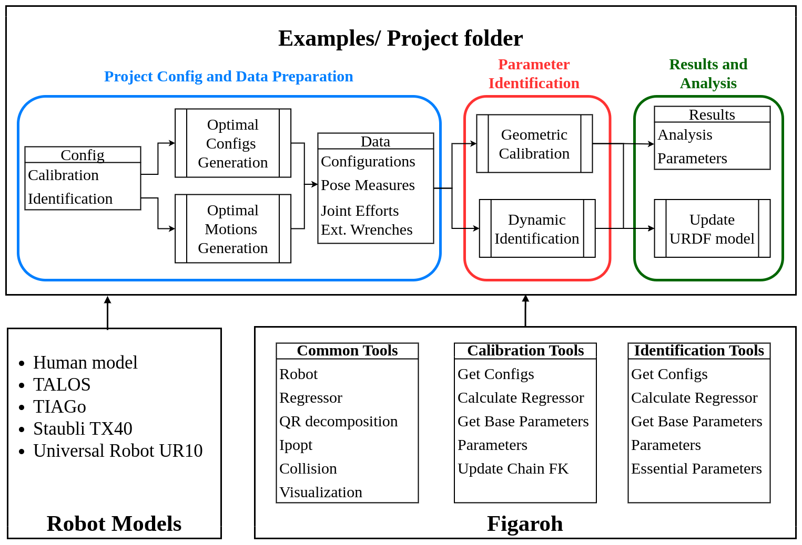

# FIGAROH
FIGAROH-Plus is a fork of [FIGAROH](https://gitlab.laas.fr/gepetto/figaroh) developed by myself as the main developer and maintainer as the output of my thesis, with contribution of colleges from Gepetto team, LAAS-CNRS.

This toolbox provides a conprehensive framework for parametric system identification of multi-body robotic systems based on the popular modeling convention URDF. Currently, it only support tree-like kinematic structures including serial manipulators, mobile manipulators, humanoids, and human mechanics.


## Installation from source

1. Install `python 3.*` (>=3.6) and `python3-pip`

2. Set up the robotpkg repositories in your source list as explained here: http://robotpkg.openrobots.org/debian.html
Then, replace `3*` with your python 3 version and then execute:
```bash
sudo apt-get install robotpkg-py3*-pinocchio robotpkg-py3*-hpp-fcl robotpkg-py3*-ndcurves
```
3. Install other dependencies
```bash
pip3 install --user numdifftools quadprog numpy scipy picos pandas meshcat pyyaml
```
4. Install `cmake` (>=3.21) as explained here: https://apt.kitware.com
5. Install FIGAROH from source
``` bash
git clone https://gitlab.laas.fr/gepetto/figaroh.git
git checkout -b pal-tiago-calib origin/pal-tiago-calib
git submodule init
git submodule update
mkdir build
cd build
cmake ..
sudo make install
```
Update python path, or put it permanent in ~/.bashrc
```bash
export PYTHONPATH=:/usr/local/lib/python3/dist-packages:$PYTHONPATH
```

## Features

As described in the following figure it provides:
+ Dynamic Identification:
    - Identification of inertial and dynamic parameters
    - Generation of continuous optimal exciting trajectories that can be played onto the robot.
    - Guide line on data filtering/pre-processing.
    - Identification pipeline with a selection of dynamic parameter estimation algorithms.
    - Calculation of physically consistent standard inertial parameters that can be updated in a URDF file.

+ Geometric Calibration:
    - Calibration model with full-set kinematic parameters.
    - Generation of optimal calibration postures based on combinatorial optimization.
    - Calibration pipeline with customized kinematic chains and different selection of external sensoring methods (eye-hand camera, motion capture) or non-external methods (planar constraints).
    - Calculatation of kinematic parameters that can be updated in URDF model.

+ Uncommon phenomena identification:
    - Identification of backlash and joint elasticity
    - Identification of suspension parameters
    - Identification of actuator dynamics
    - Identification of joint frictions

# How to Use FIGAROH

## Project Structure

A typical calibration/identification project folder structure:

```
/your-robot-project
    /config
        your-robot-config.yaml
    /data
        calibration_data.csv
        identification_data.csv
    /urdf
        your-robot.urdf
    optimal_config.py
    optimal_trajectory.py
    calibration.py
    identification.py
    update_model.py
```


## Step-by-Step Procedure

1. **Define Configuration File**

   Create a `your-robot-config.yaml` file in the `config` directory. This file should contain settings for both calibration and identification processes. Refer to the following examples for guidance:

   ```yaml
   # define parameters for calibration and identification process
   # robot: tiago
   ---
   calibration:
     calib_level: joint_offset # full_params /joint_offset
     non_geom: False
     base_frame: xtion_rgb_optical_frame # start_frame of kinematic chain
     tool_frame: hand_tool_link # end_frame of kinematic chain
     base_to_ref_frame: xtion_link # camera frame
     ref_frame: head_2_joint # parent joint frame of camera frame 
     markers:
       - ref_joint: arm_7_joint
         measure:  [True, True, True, False, False, False]
     free_flyer: False
     camera_pose: [0.0908, 0.08, 0.0, -1.57, 0.0, 0.0]
     tip_pose: [0.2163, 0.03484, 0.004, 0.0, -1.57, -1.57]
     coeff_regularize: 0.01
     outlier_eps: 0.05 #meter
     data_file: data/eye_hand_calibration_recorded_data_48c_hey5_12_test1.csv
     sample_configs_file: data/optimal_configs/tiago_optimal_configurations.yaml
     nb_sample: 500
   ```

2. **Generate Exciting Postures and Trajectories**

   a. For geometric calibration:
      - Use `optimal_config.py` to generate an optimal set of calibration postures.
      - Input: A pool of feasible sampled postures (usually from a simulator).
      - Output: An optimal set of calibration postures.

   b. For dynamic identification:
      - Use `optimal_trajectory.py` to generate optimal trajectories.
      - This script solves a nonlinear optimization problem using the Ipopt solver.
      - Constraints include joint limits, self-collision avoidance, and custom constraints.
      - The cost function aims to maximize excitation for system dynamics.

3. **Collect and Prepare Data**

   Collect experimental data and store it in CSV format in the `data` folder. The data format should match the expected input for the calibration and identification scripts.

4. **Run Calibration or Identification**

   a. For calibration:
      - Use the `calibration.py` script.
      - Modify the script to load your robot model and configuration:

   ```python
   # Example of loading robot model and configuration
   tiago = load_robot(abspath("urdf/your_robot.urdf"), load_by_urdf=True)
   tiago_calib = RobotCalibration(tiago, abspath("config/your_robot_config.yaml"), del_list=[])
   tiago_calib.initialize()
   tiago_calib.solve()
   tiago_calib.plot(lvl=1)
   ```

   b. For identification:
      - Use the `identification.py` script.
      - Ensure you've properly set up your robot model and parameters:


5. **Analyze Results**

   Both calibration and identification scripts should provide visualizations and statistical analysis of the results. Review these to assess the quality of the calibration or identification.

6. **Update Model**

   If the results are satisfactory, use `update_model.py` to update your URDF model with the new parameters, or save them to a XACRO file for future use.

## Additional Tips

- Ensure all dependencies are installed (Pinocchio, NumPy, SciPy, Matplotlib, PyYAML, Pandas, etc.).
- For different robot configurations or end-effectors, you may need separate config files (e.g., `tiago_config_hey5.yaml`, `tiago_config_palgripper.yaml`).
- When using motion capture systems, adjust the config file accordingly (e.g., `tiago_config_mocap_vicon.yaml`).
- For suspension identification or other specific tasks, refer to specialized scripts like `suspension_helper.py`.

## Troubleshooting

- If encountering issues with optimization, try adjusting constraints or cost functions in `optimal_config.py` or `optimal_trajectory.py`.
- For data processing errors, verify the CSV format and column names in your data files.
- If calibration results are unsatisfactory, try adjusting the `coeff_regularize` and `outlier_eps` parameters in your config file.

For further assistance, please refer to the documentation or contact the support team.
