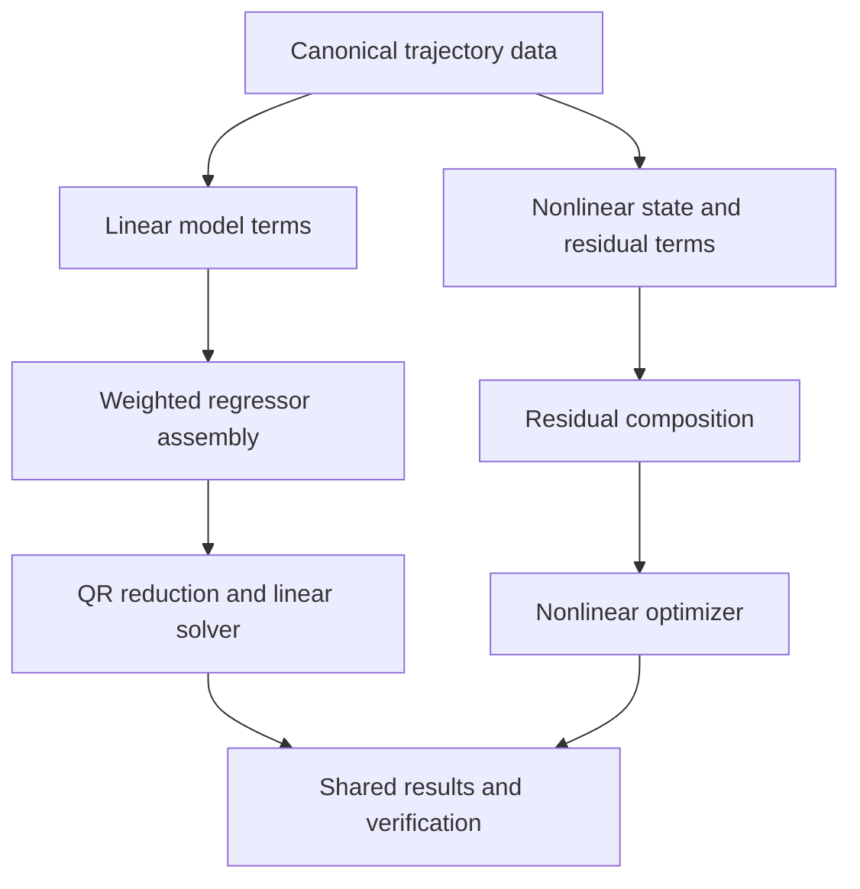

# Modular Linear Regressor / Residual Term Architecture

**Status:** Proposed — not started

**Date:** 2026-08-31 (split from the combined
`tiago-suspension-backlash-and-modular-terms-plan.md`, proposed 2026-08-28)

**Companion document:** [`tiago-suspension-backlash-examples.md`](tiago-suspension-backlash-examples.md)
covers the TIAGo suspension-identification and empirical-backlash-surface
examples, which **are** done and shipped — as standalone example scripts
that deliberately do not require any of the architecture proposed here.
This document is the not-yet-started next step: a generic composition
mechanism for FIGAROH's identification layer, motivated by (but not
required by) that example work and by the still-unbuilt physical/stateful
backlash model described below.

## Decision Summary

Evolve FIGAROH with two complementary composition mechanisms:

1. **Linear regressor terms** for models that remain linear in their unknown
   parameters, such as inertial parameters, viscous/Coulomb friction, actuator
   inertia, and constant torque offsets.
2. **Nonlinear residual terms** for models requiring latent state, nonlinear
   transforms, or nonlinear parameters, such as free-flyer suspension, backlash,
   flexible joints, and advanced actuator friction.

Both mechanisms use an explicit weighting policy and emit compatible result
metadata. They must not be collapsed into one generic `cost_function`
interface: that would obscure the distinction between a fast, rank-aware linear
solve and a nonlinear least-squares problem.

Extract a core primitive only after it has a second concrete consumer and a
stable, dependency-light contract. The immediate candidates are typed
trajectory/wrench data, whitening, bounded-domain checks, and linear-solve
diagnostics. Do not introduce `BaseNonlinearIdentification` solely for the
TIAGo suspension prototype.

## Proposed Physical Backlash Model

The empirical `EmpiricalBacklashSurface` model (done — see the companion
document) is a direction- and load-conditioned kinematic correction
surface. It is not a physical backlash state model: it has no persistent
contact state, no explicit gap width, and no prediction of dynamic
transmission torque.

A second, dynamic model is needed for torque prediction and simulation. Backlash
cannot be modeled credibly as another static `sign(dq)` regressor column. It is
hysteretic: the transmitted-side joint coordinate has memory of motion reversals
and may be unobservable without sufficient reversal excitation.

Start with a symmetric deadband state model per selected joint:

$$
q_{l,j}(t)=\mathcal{B}(q_{m,j}(t);\delta_j,z_j(t)),
$$

where $q_m$ is the motor/encoder coordinate, $q_l$ is the load-side coordinate,
$\delta_j \geq 0$ is backlash half-width, and $z_j$ is a discrete/contact state
updated when the motor crosses a deadband boundary. Rigid-body dynamics and
kinematics must consume $q_l$, not $q_m$.

The first identification objective should use an independently observed load-side
quantity, such as end-effector pose from mocap/camera, or a torque residual with
known motor torque:

$$
\min_{\delta,\eta}\sum_t\left\|W(q_l,\dot q_l,\ddot q_l)\phi+\tau_{\mathrm{act}}(\eta)-\tau_{\mathrm{meas}}\right\|_{\Sigma^{-1}}^2
 + \lambda\|\delta\|_2^2.
$$

Here $\eta$ represents optional actuator terms and $\Sigma$ is measurement
covariance. Do not identify backlash simultaneously with unconstrained inertial,
friction, offsets, and suspension parameters in the first release: their effects
are strongly confounded around reversals and low speed.

Recommended progression:

1. Port and validate `backlash.empirical_surface` against the historical
   relative-versus-absolute-encoder/Vicon experiment. **Done** — see the
   companion document.
2. Identify static encoder offsets and rigid-body inertial parameters using
   reversal-free or high-speed sections.
3. Hold those parameters fixed or use informative priors.
4. Identify physical deadband backlash from segments rich in direction reversals
   and independent load-side observations.
5. Jointly refine only after a profile-likelihood or multi-start study shows the
   parameters are identifiable.

Steps 2-5 are not started.

## Recommended Architecture

### Keep the Solver Families Separate



`BaseIdentification` remains the linear workflow. It keeps zero-column
elimination, decimation, QR base reduction, physical-consistency handling, and
current solver APIs. Any future internal conversion of friction, actuator-
inertia, and offset flags into linear terms must preserve current public defaults
and result ordering.

### Conditional Core Promotion

Promote a primitive to core FIGAROH only after it has a second user and passes
the following gates:

1. A documented, robot-neutral data contract with SI units, timestamps, frames,
    joint order, valid masks, and no ROS/Vicon dependency.
2. Synthetic recovery tests plus held-out improvement on TIAGo.
3. A second robot or simulator fixture that uses the same API without
    TIAGo-specific branches.
4. Stable result metadata: model version, parameter units/bounds, fitted domain,
    solver/weighting policy, rank/conditioning, and validation metrics.
5. Core imports still work without example, hardware, mocap, or bag-reader
    dependencies.

Only a physical, stateful backlash model that passes these gates should enter an
experimental core namespace such as `figaroh.identification.experimental`. The
empirical polynomial surface and the TIAGo suspension workflow remain
example-specific artifacts (see the companion document) — neither has a
second consumer yet, so none of these gates apply to them today.

### Small Interfaces, Not a Global Registry

Avoid a package-wide mutable registry at first. Use explicit term lists created
by a validated config factory. The useful stable interfaces are:

```python
class LinearRegressorTerm(Protocol):
    name: str
    def parameter_spec(self, robot, config) -> ParameterSpec: ...
    def build_columns(self, trajectory, context) -> np.ndarray: ...

class ResidualTerm(Protocol):
    name: str
    def residual(self, parameters, trajectory, context) -> np.ndarray: ...

class WeightPolicy(Protocol):
    def whiten(self, residuals, layout, trajectory, context) -> np.ndarray: ...
```

`ParameterSpec` carries names, units, bounds, initial values, prior scales,
joint scope, and whether a term is linear. `layout` records exact residual row
provenance: sample, signal, frame, marker, and component. This is essential for
correct weighting and human-readable reports.

## Weighting Recommendation

Use **whitening**, not informal scalar weights. For residual $r$, apply a square
root information matrix $L$ such that $L^TL=\Sigma^{-1}$ and minimize:

$$
\min\|Lr\|_2^2.
$$

For linear identification, whiten both sides before QR reduction:

$$
W_w=LW, \qquad \tau_w=L\tau.
$$

This preserves the linear solve and makes QR conditioning, covariance, and
quality metrics coherent. For calibration/nonlinear identification, return the
whitened residual vector to `least_squares`.

Initial built-in policies should be intentionally small:

| Policy | Use |
| --- | --- |
| Identity | Backward-compatible default |
| Per-signal diagonal | Position/orientation, force/moment, torque channels |
| Per-sample diagonal | Known sensor confidence or valid-mask handling |
| Block covariance | Correlated 6D pose or wrench measurements |

Robust losses should remain solver options (`loss="huber"`, Cauchy, or existing
robust linear solve), not independent weights. Mixing outlier loss and weights
without a documented order makes uncertainty interpretation unreliable.

Note: the shipped suspension/backlash examples currently use plain
(implicitly identity-weighted) linear least squares — none of the above
policies are implemented yet, in either the examples or core.

## Backward Compatibility Contract

The modular architecture is an internal refactor first. Existing FIGAROH users
must obtain the same behavior unless they explicitly enable a new task type,
term, or weighting policy.

| Surface | Compatibility requirement |
| --- | --- |
| Python imports | Preserve `BaseIdentification`, `BaseCalibration`, `RegressorBuilder`, and current public helper imports; new classes are additive |
| Existing constructors and methods | Preserve positional/keyword signatures and default values; introduce new behavior through optional keyword arguments only |
| Legacy YAML | Continue parsing through `get_param_from_yaml`; do not add required legacy keys |
| Unified YAML | Preserve the existing `tasks.identification.problem.model_components` boolean flags and their defaults |
| Migration utility | Extend `config_migration` only with additive fields; preserve unknown/unconsumed values under `custom` as it does today |
| Default term composition | Produce the exact existing term order: inertial, `fv`, `fs`, `Ia`, `off` |
| Default numerical result | Identity weighting must reproduce the current regressor, zero-column elimination, QR base indices, estimates, and reported metrics within numerical tolerance |
| Result/report schema | Preserve existing `result` and verification keys; add `terms`, `weighting`, and nonlinear diagnostics as optional metadata |
| Optional dependencies | Core FIGAROH imports and existing workflows must work without mocap, rosbag, or extra nonlinear-model dependencies |

Do not replace existing booleans with a required list such as `terms: [...]`.
For the first compatible release, derive the internal term list from the current
flags when `terms` is absent. A new explicit term list is opt-in and must reject
ambiguous combinations rather than silently changing the legacy interpretation.

```yaml
# Existing configuration: unchanged behavior and term order.
problem:
  model_components:
    friction: true
    actuator_inertia: true
    joint_offset: true

# New opt-in configuration: equivalent explicit representation.
terms:
  - type: inertial
  - type: friction.coulomb_viscous
  - type: actuator.inertia
  - type: actuator.torque_offset
weighting:
  type: identity
```

If both forms are provided, require them to be semantically identical in the
first release. Emit a targeted error for disagreement. Later releases may
deprecate the booleans with one minor-release warning period, a migration tool
update, and a published removal version; do not deprecate them while the
term-based implementation is still proving parity.

### Compatibility Test Gates

Every implementation phase must include these regression checks:

1. Existing legacy identification and calibration configs still parse and retain
   their current defaults.
2. Legacy to unified to legacy round trips preserve free-flyer, eye-hand,
   friction, actuator-inertia, and offset semantics.
3. For representative fixtures, current flags and equivalent explicit terms
   produce equal regressor shape, column names/order, active-column mask, QR base
   selection, parameter estimate, torque prediction, and verification verdict.
4. Identity weighting produces equal results to the pre-refactor code; weighted
   execution is opt-in.
5. Existing JSON/HTML consumers can read old results, and old consumers can
   ignore newly added metadata fields.
6. Import tests run in the base dependency environment without optional
   suspension/backlash/adaptor packages.

Store golden baseline artifacts from current `main` before the refactor. Compare
floating-point arrays with documented absolute/relative tolerances, never with
textual HTML equality. The report should state the FIGAROH version, config
schema mode, selected terms, and weighting policy so a result remains
interpretable across releases.

## Migration Plan

Numbered to continue from the completed Phase 1-4 in
[`tiago-suspension-backlash-examples.md`](tiago-suspension-backlash-examples.md).
None of the phases below are started.

### Phase 5: Compatibility Harness Before Core Refactor

Capture golden outputs for representative existing identification and calibration
fixtures. Add parity tests for legacy/unified config round trips, regressor
columns, QR selection, estimates, report JSON, and verification verdicts. Add
import tests without optional dependencies.

**Gate:** the harness fails when any current default behavior, public import, or
serialized field is changed unexpectedly.

### Phase 6: Conditional Linear-Term Refactor

Refactor current friction, actuator inertia, and constant offset columns into
`LinearRegressorTerm` implementations behind the existing config flags. Preserve
current column order and outputs by default. Introduce optional whitening after
this parity is proven. Do this only when a second core consumer makes the
internal abstraction worthwhile.

**Gate:** existing identification unit and integration tests are unchanged, and
old/new regressors and estimates match to numerical tolerance on fixtures.

### Phase 7: Physical Backlash Research Prototype

Implement a single-joint deadband state transition in an isolated research
fixture first. Add a pose-based TIAGo or simple pendulum experiment containing
controlled reversals, fixed inertials, and separated calibration/validation
segments. Keep it in examples until the conditional core-promotion gates pass.

**Gate:** known synthetic backlash width is recovered across multiple noise seeds;
no-reversal trajectories trigger an explicit insufficient-excitation verdict.

### Phase 8: Selective Joint Refinement

Only after Phase 7, evaluate joint refinement of backlash with friction and
actuator terms. Require multi-start consistency, profile likelihood, parameter
correlations, and a held-out improvement threshold before declaring it supported.

**Gate:** documented identifiability result and improvement over the fixed-
parameter baseline on held-out reversal trajectories.

## Validation and Acceptance Criteria

| Area | Minimum evidence |
| --- | --- |
| Physical backlash | Synthetic state-transition recovery and no-excitation rejection |
| Linear refactor | Exact/near-exact parity with the current regression path |
| Weighting | Identity parity plus covariance-scaled test case |

Do not accept a model solely because total residual decreases: it must improve a
held-out trajectory and should not introduce nonphysical signs, negative
stiffness, or unstable rollout behavior.

## Risks and Mitigations

| Risk | Mitigation |
| --- | --- |
| Over-generalized term framework | Start with explicit built-in term lists, no plug-in registry |
| Broken current users | Preserve existing YAML flags and output ordering during the linear-term refactor |

## Recommendation

The modular direction is worthwhile, with one adjustment: name the abstraction
after the mathematical role, not after a generic cost function. Use **regressor
terms** for linear identification and **residual terms** for nonlinear problems.
Put weighting in a shared whitening layer, and keep robust loss/regularization as
solver concerns.

Extract core primitives only after a second consumer appears — the completed
suspension/backlash examples in the companion document are the *first*
consumer, not the second, so nothing described here should be promoted to
core FIGAROH yet. Backlash should advance from the empirical surface to a
separately validated stateful model only when the targeted reversal
experiments demonstrate identifiability; it must not become another
boolean under `model_components`.
