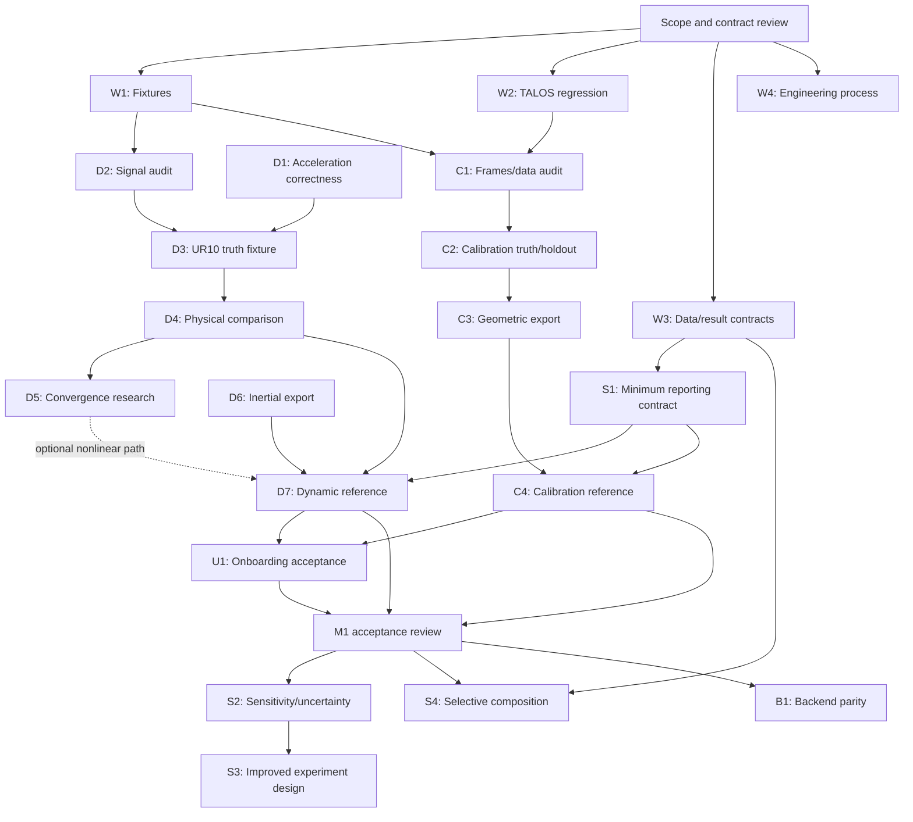

# Identification and calibration delivery plan

**Status: Tracker setup approved; execution details under review — revision 4, 2026-10-02.**
Confirmed user preferences: advance calibration alongside dynamic identification;
TIAGo mocap is the first calibration reference, with TALOS contact as the
second consumer/regression target. The user authorized GitHub milestone/issue creation on 2026-10-02 and requested
one-by-one delivery. Tracker setup does not accept unresolved public interfaces,
change solver defaults, or approve automatic implementation/merges. Review issue
readiness before selecting implementation work. Existing approved work and open PRs
retain their own review gates.

## Purpose and scope

Deliver two trustworthy workflows within the existing package structure:

1. Measurements → dynamic identification → physical model → held-out effort
   verification → inertial URDF export/reload → archived report.
2. Measurements → geometric calibration → identifiable corrections → held-out
   pose/contact verification → geometric export/reload → archived report.

The workstreams proceed in parallel through focused PRs, not simultaneous
edits to shared workflow classes. Their shared foundations are provenance,
units/frames, explicit result stages, validation and reproducible artifacts.
Dynamic and geometric solvers remain mathematically distinct.

The [roadmap](../source/further_reading/roadmap.md) owns priority and milestone outcomes.
This document owns the proposed work breakdown, dependencies, alternatives
and review sequence. Once approved, GitHub issues own changing task status
and detailed acceptance criteria. [Architecture](../source/concepts/architecture.md) continues
to describe existing code, not these proposed contracts. Existing design
records remain authoritative for their scope; this plan does not supersede
the modular-terms, Pinocchio-support or log-Cholesky decisions.

## Evidence motivating the plan

| Observation at 2026-10-02 | Consequence |
| --- | --- |
| Core #32 reproduces missing final-joint acceleration | Signal correctness precedes new dataset-based numerical claims |
| UR10/TIAGo sampling/filter assumptions disagree | Add explicit timing and derivative provenance before refitting |
| Exact base-preserving SDP returns no accepted model on the three robot datasets | Diagnose constraints/scaling; distinguish reconstruction from direct constrained estimation |
| All dataset log-Cholesky fits exhaust 200 evaluations | Keep #23–#25 conditional; investigate #30 rather than promote finite candidates |
| Per-link projection succeeds on UR10/TX40 but changes the base fit | Report it as a separate method and select exported stages explicitly |
| Inertial URDF first-moment/tensor handlers are stubs | A file-write success cannot close physical-model delivery |
| Examples CI fails on missing Hey5 geometry and TALOS 3.7 held-out regression | Make assets reproducible and retain numerical regression gates |
| Current examples have robot-specific loaders and existing reporting/export helpers | Improve adapters and reuse primitives before proposing a new framework |

Sources: core issues #20/#22–#25/#30/#32, core PR #31, examples issues
#11/#12/#14 and draft PR #13. The examples dynamic report and supplemental
analysis are still local additions on the PR branch. Reports include failed
solver statuses and preprocessing limitations; they are not scientific go
approval. Current issue/PR status must be checked when work starts.

## Ownership within the current repositories

| Concern | Existing owner | Proposed change boundary |
| --- | --- | --- |
| Dynamics preprocessing and regression | `figaroh/identification/{identification_tools,base_identification,parameter}.py` and `tools/regressor.py` | Fix numerical contracts and expose diagnostics through existing workflow |
| Physical checks, projection, reconstruction | `identification/{physical_consistency,reconstruction}.py` | Keep distinct operations; add a research constrained-fit comparator before production design |
| Geometric preprocessing/solving | `calibration/{base_calibration,calibration_tools,data_loader,config}.py` | Fix proven problems; retain frame conventions and existing subclasses |
| Export and export verification | `tools/{urdf_exporter,export_validation,geometric_calibration_export}.py` | Reuse handlers/checks; complete missing inertial semantics |
| Reports and archives | `tools/{identification_report,report,compare_report,run_archive}.py`, `utils/results_manager.py` | Reuse output machinery; add explicit stage/provenance fields through an approved contract |
| Robot I/O and conversions | `figaroh-examples/examples/<robot>/utils/` | CSV adapters, current-to-effort mapping and robot-specific assumptions stay here |
| Robot models/config/data | `examples/<robot>/{urdf,config,data}` and shared `models/` | Preserve originals; document sources, frames, sample rates and redistribution constraints |
| Research comparisons | Core private `docs/development/spikes/`; examples `benchmarks/` | Explicit source/commit dependency; never present as supported package API |
| Reference user workflows | Existing robot entry points under `examples/<robot>/` | Integrate validated primitives after research acceptance; avoid a competing CLI |

No `TrajectoryData` class was found in the current source audit. A typed data
contract is a proposal, not an existing API. First inventory existing
trajectory dictionaries and calibration measurement structures. Extend those
or introduce one narrow type only after an ADR demonstrates two consumers,
conversion rules and backward-compatible adapters. Keep dynamic trajectory
samples and geometric pose/contact observations as separate payloads.

## Dependency structure

Log-Cholesky #30 can use the independent analytic core fixture while D1 is
being repaired. Its real-dataset conclusions wait for D1/D2. Inertial export
can be tested with known feasible parameters independently of solver success.
Calibration need not wait for dynamic optimization, but changes to shared
export/report code require paired regression coverage and serial integration.

## Work-package milestones and PR boundaries

### Work-package milestone rules

Each work package is a **delivery milestone** beneath a roadmap outcome M0–M3.
M1.1–M1.4 are acceptance gates, not additional issue containers. Package IDs are
stable package identifiers, distinct from GitHub issue numbers. GitHub
milestones use these IDs; existing issues are reused and missing tasks have
explicit owning packages. The package table below defines their roadmap mapping.

A package can be marked **Cleared** only when:

1. Its reviewed issue roster is complete, including linked core and examples
   issues. Assign each issue one owning package; link dependencies elsewhere.
2. **Every included issue is resolved with its acceptance criteria met**, its
   required PRs reviewed/merged, and evidence linked. Closing an issue as a
   duplicate, deferred or “not planned” does not satisfy that obligation.
3. Package-level integration/acceptance evidence also passes on the declared
   revision pair. All issue closures alone are insufficient if the combined
   workflow still fails its gate.
4. A maintainer reviews the closure record and confirms the accepted outcome.

Before Ready, record owner, roadmap gate, issue roster, dependencies, acceptance
criteria and evidence location. At closure, retain issue/PR links, tested
revisions, commands, report and any limitations. Status is Draft → Ready → In
progress → In review → Cleared; blocked work retains its unmet dependencies.
An empty draft roster cannot be treated as a completed milestone.

Deferral requires an explicit reviewed scope change: preserve the original
issue and reason, move it to a named future package, and update the roadmap
mapping if its exit criteria change. Do not silently remove unresolved issues
to clear a package. Cross-repository milestones need one canonical roster
(parent issue/project record) linking both repositories, since their individual
GitHub milestone views do not provide a combined closure record.

D5 is a separate research milestone. Its issues must all meet the agreed
research criteria to clear D5, but D5 is not required for the supported baseline
M1 scope. Promoting the nonlinear path adds D5 and #23–#25 to that path's reviewed
roster; none are silently treated as completed by D7. Basic acquisition/design
guidance is part of U1; S3 is the later algorithmic improvement milestone.

| ID / canonical tracker | Roadmap outcome / gate | Outcome / justification | Repository and dependencies | Acceptance evidence |
| --- | --- | --- | --- | --- |
| [W1](https://github.com/thanhndv212/figaroh-plus/issues/33) | M0; enables M1.1 | Reproducible examples environment and fixtures | Examples; existing PR #13 plus focused asset follow-up | Clean checkout resolves required geometry; pinned sources/licenses; explicit dependency failures; no reliance on a developer ROS search path |
| [W2](https://github.com/thanhndv212/figaroh-plus/issues/34) | M0; enables calibration M1.1 | Explain TALOS Linux/3.7 regression | Examples #14, core companion only if cause is generic | Capture solver status, seeds, native versions and both chains; reproduce before/after; retain current improvement gate until independently justified |
| [W3](https://github.com/thanhndv212/figaroh-plus/issues/35) | M1 shared contract; M2 prerequisite | Working data/result contracts | Proposed core ADR after inventory of both workflows | Joint/order/frame/unit/timestamp provenance, observed vs reconstructed effort, masks, split IDs and optional fields; documented adapters preserve old users |
| [D1](https://github.com/thanhndv212/figaroh-plus/issues/36) | M1.1 dynamic | Correct every tangent acceleration coordinate | Core #32 | Analytic final-joint regression, constant/variable dt, invalid timestamps and documented `nq != nv` policy; affected examples rechecked |
| [D2](https://github.com/thanhndv212/figaroh-plus/issues/37) | M1.1 dynamic | Audit robot signal processing | Separate examples issues for UR10 and TIAGo | Recorded vs inferred timestamps; explicit filter rates/cutoffs/order; torque/current units/signs; trim/decimation index provenance; immutable raw files |
| [D3](https://github.com/thanhndv212/figaroh-plus/issues/38) | M1.2 dynamic | Fresh UR10 truth fixture and benchmark protocol | Examples; D1/D2 | Save verified true inertias, analytic q/dq/ddq, independent train/validation trajectories and noise seeds; no ground-truth parameter claims from old CSVs |
| [D4](https://github.com/thanhndv212/figaroh-plus/issues/39) | M1.2 dynamic | Fair physical-estimation comparator | Private core spike + linked examples experiment; D3 | Base OLS, exact reconstruction, direct LMI-constrained effort fit, per-link projection and log-Cholesky; common inputs; comparable objectives and extras policy; separate failures |
| [D5](https://github.com/thanhndv212/figaroh-plus/issues/40) | M1.2 optional nonlinear research | Convergence/scaling revision | Core #30; analytic fixture now, robot evaluation after D3/D4 | Objective/gradient histories, scaling/bounds/prior ablations, multiple starts and justified budget; preserve earlier protocol; current #30 acceptance criteria govern go |
| [D6](https://github.com/thanhndv212/figaroh-plus/issues/41) | M1.3 dynamic | Complete inertial export | Core; prior mapping review and known-parameter fixture | Mass/first moments/CoM, origin vs CoM tensor and inertial rotation handled; export/reload matches intended RNEA and physical verdict; unsupported targets fail explicitly |
| [D7](https://github.com/thanhndv212/figaroh-plus/issues/42) | M1.4 dynamic | Accepted dynamic reference workflow | Core integration + examples; D4/D6/S1; D5 only for optional nonlinear path | Explicit selected stage, fit and genuine validation splits, per-joint units, physical/solver verdict, exported model and archive; successful supported baseline can ship without nonlinear go |
| [C1](https://github.com/thanhndv212/figaroh-plus/issues/43) | M1.1 calibration | Audit geometric data/frames and reproduction | Examples with focused core fixes; W1/W2 | Named observation frames, translation/rotation units, timestamps, measurement source and split policy; TIAGo and TALOS current behavior captured |
| [C2](https://github.com/thanhndv212/figaroh-plus/issues/44) | M1.2 calibration | Calibration synthetic truth + real held-out reference | Examples; C1 | Known synthetic corrections recovered in identifiable coordinates; held-out pose/contact errors on unused postures; diagnose gauge, priors and solver failures |
| [C3](https://github.com/thanhndv212/figaroh-plus/issues/45) | M1.3 calibration | Validate redistribution and geometric export | Existing core QR/export helpers + examples; C2 | Calibrated-model FK matches exported/reloaded model; parameter/frame semantics retained; PAL runtime YAML checked where relevant; metrology frames are not silently embedded |
| [C4](https://github.com/thanhndv212/figaroh-plus/issues/46) | M1.4 calibration | One accepted calibration reference workflow | Examples TIAGo mocap selected; C2/C3/S1 | One command, training/held-out report, identifiable vs redistributed corrections, export and archive; contact-only evidence labeled separately from full pose metrology |
| [S1](https://github.com/thanhndv212/figaroh-plus/issues/47) | M1.4 shared reporting prerequisite | Minimum reporting contract | Existing core report/archive modules; W3; enables D7/C4 | Separate solver/data/fit/physical/export verdicts, explicit failed/fallback stages, paired revisions/hashes, old result compatibility |
| [S2](https://github.com/thanhndv212/figaroh-plus/issues/48) | M2 follow-up diagnostics | Sensitivity and uncertainty | Core diagnostics + examples; stable D7/C4 | Noise/initialization trials, singular spectrum and parameter correlations; observable combinations reported; no unjustified full-parameter certainty |
| [S3](https://github.com/thanhndv212/figaroh-plus/issues/49) | M2 follow-up experiment design | Improved experiment design | Existing `optimal/` + examples; S2 | Compare excitation/posture selection with a frozen baseline under declared constraints; improve independent validation evidence rather than only matrix condition |
| [W4](https://github.com/thanhndv212/figaroh-plus/issues/50) | M0 | Engineering process and regression coverage | Both repositories; existing validation/contribution rules | Reviewed workflow changes, focused legacy lint/mock coverage issues, reproducible checks; claimed CI automation verified on hosted runs |
| [U1](https://github.com/thanhndv212/figaroh-plus/issues/51) | M1.4 shared onboarding | General robot/dataset guide and worked briefs | Core docs + examples; draft now, acceptance uses D7/C4 | Fresh dynamic and TIAGo mocap walkthroughs plus missing-data case; supported commands, methods and limitations verified |
| [S4](https://github.com/thanhndv212/figaroh-plus/issues/52) | M2 composition | Selective reusable regressor/residual composition | Core + two examples consumers; W3 and accepted M1 references | Narrow ADR, two consumers, legacy numerical parity and additive compatibility; no broad refactor prerequisite |
| [B1](https://github.com/thanhndv212/figaroh-plus/issues/53) | M3 | Backend capability/parity review | Core `backends/`/`integration/`; accepted reference workflow | Actual backend selection or explicit rejection, supported operations matrix, same model/state comparisons and export/validation parity |

Potential new work must not duplicate #20/#22–#25/#30/#32 or examples
#11/#12/#14. If one package contains independent defects, split them into
individual issues/PRs rather than closing a broad issue with partial evidence.

## GitHub delivery register

Milestones and their canonical rosters were created on 2026-10-02. Open each
tracker for its complete issue roster, dependency links and acceptance evidence.
Core trackers combine both repositories; GitHub milestone percentages are local
to a repository and do not supersede the closure review. No due dates or
automatic merging are configured by this setup.

| Package | Core milestone | Examples milestone |
| --- | --- | --- |
| [W1](https://github.com/thanhndv212/figaroh-plus/issues/33) | [Open milestone](https://github.com/thanhndv212/figaroh-plus/milestone/1) | [Open milestone](https://github.com/thanhndv212/figaroh-examples/milestone/1) |
| [W2](https://github.com/thanhndv212/figaroh-plus/issues/34) | [Open milestone](https://github.com/thanhndv212/figaroh-plus/milestone/2) | [Open milestone](https://github.com/thanhndv212/figaroh-examples/milestone/2) |
| [W3](https://github.com/thanhndv212/figaroh-plus/issues/35) | [Open milestone](https://github.com/thanhndv212/figaroh-plus/milestone/3) | [Open milestone](https://github.com/thanhndv212/figaroh-examples/milestone/3) |
| [D1](https://github.com/thanhndv212/figaroh-plus/issues/36) | [Open milestone](https://github.com/thanhndv212/figaroh-plus/milestone/4) | No examples-owned issues in this roster |
| [D2](https://github.com/thanhndv212/figaroh-plus/issues/37) | [Open milestone](https://github.com/thanhndv212/figaroh-plus/milestone/5) | [Open milestone](https://github.com/thanhndv212/figaroh-examples/milestone/4) |
| [D3](https://github.com/thanhndv212/figaroh-plus/issues/38) | [Open milestone](https://github.com/thanhndv212/figaroh-plus/milestone/6) | [Open milestone](https://github.com/thanhndv212/figaroh-examples/milestone/5) |
| [D4](https://github.com/thanhndv212/figaroh-plus/issues/39) | [Open milestone](https://github.com/thanhndv212/figaroh-plus/milestone/7) | [Open milestone](https://github.com/thanhndv212/figaroh-examples/milestone/6) |
| [D5](https://github.com/thanhndv212/figaroh-plus/issues/40) | [Open milestone](https://github.com/thanhndv212/figaroh-plus/milestone/8) | No examples-owned issues in this roster |
| [D6](https://github.com/thanhndv212/figaroh-plus/issues/41) | [Open milestone](https://github.com/thanhndv212/figaroh-plus/milestone/9) | No examples-owned issues in this roster |
| [D7](https://github.com/thanhndv212/figaroh-plus/issues/42) | [Open milestone](https://github.com/thanhndv212/figaroh-plus/milestone/10) | [Open milestone](https://github.com/thanhndv212/figaroh-examples/milestone/7) |
| [C1](https://github.com/thanhndv212/figaroh-plus/issues/43) | [Open milestone](https://github.com/thanhndv212/figaroh-plus/milestone/11) | [Open milestone](https://github.com/thanhndv212/figaroh-examples/milestone/8) |
| [C2](https://github.com/thanhndv212/figaroh-plus/issues/44) | [Open milestone](https://github.com/thanhndv212/figaroh-plus/milestone/12) | [Open milestone](https://github.com/thanhndv212/figaroh-examples/milestone/9) |
| [C3](https://github.com/thanhndv212/figaroh-plus/issues/45) | [Open milestone](https://github.com/thanhndv212/figaroh-plus/milestone/13) | [Open milestone](https://github.com/thanhndv212/figaroh-examples/milestone/10) |
| [C4](https://github.com/thanhndv212/figaroh-plus/issues/46) | [Open milestone](https://github.com/thanhndv212/figaroh-plus/milestone/14) | [Open milestone](https://github.com/thanhndv212/figaroh-examples/milestone/11) |
| [S1](https://github.com/thanhndv212/figaroh-plus/issues/47) | [Open milestone](https://github.com/thanhndv212/figaroh-plus/milestone/15) | [Open milestone](https://github.com/thanhndv212/figaroh-examples/milestone/12) |
| [S2](https://github.com/thanhndv212/figaroh-plus/issues/48) | [Open milestone](https://github.com/thanhndv212/figaroh-plus/milestone/16) | [Open milestone](https://github.com/thanhndv212/figaroh-examples/milestone/13) |
| [S3](https://github.com/thanhndv212/figaroh-plus/issues/49) | [Open milestone](https://github.com/thanhndv212/figaroh-plus/milestone/17) | [Open milestone](https://github.com/thanhndv212/figaroh-examples/milestone/14) |
| [W4](https://github.com/thanhndv212/figaroh-plus/issues/50) | [Open milestone](https://github.com/thanhndv212/figaroh-plus/milestone/18) | [Open milestone](https://github.com/thanhndv212/figaroh-examples/milestone/15) |
| [U1](https://github.com/thanhndv212/figaroh-plus/issues/51) | [Open milestone](https://github.com/thanhndv212/figaroh-plus/milestone/19) | [Open milestone](https://github.com/thanhndv212/figaroh-examples/milestone/16) |
| [S4](https://github.com/thanhndv212/figaroh-plus/issues/52) | [Open milestone](https://github.com/thanhndv212/figaroh-plus/milestone/20) | No examples-owned issues in this roster |
| [B1](https://github.com/thanhndv212/figaroh-plus/issues/53) | [Open milestone](https://github.com/thanhndv212/figaroh-plus/milestone/21) | [Open milestone](https://github.com/thanhndv212/figaroh-examples/milestone/17) |
| [LC1](https://github.com/thanhndv212/figaroh-plus/issues/20) | [Open milestone](https://github.com/thanhndv212/figaroh-plus/milestone/22) | [Open milestone](https://github.com/thanhndv212/figaroh-examples/milestone/18) |

**LC1** uses existing core #20 as the canonical conditional-production tracker
for core #23–#25 and examples #11. D5 owns research #22/#30; its accepted go
decision is a dependency, not completion of those production issues. LC1 is
outside baseline M1 closure and introduces no additional production scope.

Initial queue: D1 / core #32 is a ready correctness fix. W1 asset reproduction,
W2 / examples #14 and individual signal/contract audits are also ready to
investigate. Later packages remain blocked or planned as labeled. Select one
issue, validate its focused change, open its PR, then await review/merge approval.

## Experimental design decisions to review before coding

### Dynamic identification

Use two comparison levels. The first holds identical training-estimated extras
fixed to isolate inertial estimation; the second jointly estimates physical
extras where supported. Do not rank a joint solver against a frozen-extra
solver as though only parameterization changed. Define per-joint residual
scaling from training noise/units if whitening is proposed, and first retain
an unweighted compatibility baseline. TIAGo force and torque cannot become
one unlabeled physical RMSE.

Full SDP equality reconstruction preserves an estimated base vector; direct
constrained effort fitting may change it; per-link projection may change both
base fit and effort. Each needs its own objective, success definition and
stage label. Boundary solutions and massless fixed links need explicit policy.
No API is chosen just because one research script already contains a function.

Freeze ranks/tolerances, bounds, noise, initialization, iteration/evaluation
budget, timeout and quality metrics before measuring. Preserve the old
protocol. The existing #30 criteria are not relaxed by this plan; any revised
criterion requires a reasoned decision before new measurements.

### Calibration

TIAGo mocap is the user-selected first real reference because existing redistribution
and runtime-export support can be reused. TALOS table-contact remains a second
consumer and a regression target, not a substitute for full 6D ground truth.
Use held-out postures/recordings with no fit-stage leakage. Address gauge/frame
ambiguity before interpreting individual geometric corrections or covariance.
Assess translated and rotational residuals separately unless a justified
measurement covariance defines a common whitened residual.

New camera/eye-hand, multi-marker or suspension features are candidates for a
separate reviewed scope after the reference baseline; they are not implicitly
included in this iteration. Historical port documents must be re-audited.

## General onboarding pipeline alongside the references

The two reference workflows are demonstrations, not the only supported route
for users. Add a reusable decision pipeline for any new robot/dataset without
creating a new runtime orchestration API in this planning phase:

1. Inventory available models, sensors, timestamps, measured/derived channels
   and independent validation; record missing information.
2. Define the application, observation model, parameter blocks, fixed quantities,
   gauge and limits on what the data can identify.
3. Select supported baseline/candidate methods by objective, constraints and
   noise/prior assumptions; label research paths separately.
4. Design acquisition and final validation together, reviewing excitation,
   observation coverage, feasibility and collection constraints.
5. Preserve raw measurements; audit clocks, units, frames, synchronization,
   derivatives/filter rates and raw-to-processed indices.
6. Fit under a frozen protocol; interpret training fit, observability, physical
   feasibility and solver termination separately.
7. Evaluate unused data, inspect computed/skipped verification checks, validate
   exported-model parity and archive reproducible evidence.

Core `docs/source/example_workflow.md` owns this scientific decision guide.
Existing task tutorials link to it and retain task-specific runnable material.
Examples `docs/new-example-guide.md` owns repository integration and
`docs/experiment-brief-template.md` provides a human-readable record copied into
`examples/<robot>/EXPERIMENT.md`. This is not a new YAML schema or an enforced
runtime contract. Robot README/data notes own actual measurements and commands;
CONTRIBUTING owns contributor/review rules.

**Work-package milestone U1 — general user onboarding** runs alongside D7/C4.
Draft the guide now; validate it later by walking through one fresh dynamic
example and TIAGo mocap, plus a missing-data case. Acceptance means the brief
leads to an explicit model/method choice, reproducible processing and applicable
validation without relying on undocumented reference assumptions. Check that
supported commands/links match the accepted core/examples revisions; label
unimplemented methods and missing evidence. Do not add an interactive wizard,
new config keys or generated acquisition code without separate review.

Round 2 reviews the brief's questions and evidence requirements alongside the
data/result contracts. Reference delivery PRs provide worked briefs and expose
where the generic guide needs correction. U1 does not wait for backend expansion
or a successful research-only log-Cholesky integration.

## Repository and documentation organization

Preserve existing directories and user entry points. Do not move datasets,
robot helpers or broad packages as a prerequisite to fixing known defects.

- Core `ROADMAP.md`: milestone order, priorities and exit criteria; one canonical
  file embedded by the docs site. Stable M0–M3 IDs remain.
- Core `docs/plans/`: this active execution proposal; `archive/` keeps old plans.
  Add an index with explicit Draft/Accepted/Historical status.
- Core `docs/decisions/`: narrow ADRs for new schemas/interfaces/objectives.
  Link to existing decisions rather than duplicating their reasoning.
- Core `docs/development/`: dated audits and validation evidence; private spikes
  remain marked experimental. Architecture changes only after facts change.
- Examples `benchmarks/`: research protocol, comparisons, curated small result
  records and dated reports. Preserve old protocols and source hashes.
- Examples `examples/<robot>/`: runnable supported recipes and robot data/config
  notes. Large generated runs remain outside source control or in CI artifacts.
- Each repository `CONTRIBUTING.md`: its execution/PR instructions. Core owns the
  shared rules; examples documents exact commands, dependency pairing, fixtures
  and its `main` PR target rather than copying the whole core workflow.

Existing examples `.github/` ignore rules and local-only CI material need a
focused tracked-file audit before adding more automation. A local file or
passing local test is not proof that it is tracked or executed remotely.

## Proposed development workflow improvements

These amendments are for review; CONTRIBUTING/AGENTS are not silently replaced
by this draft. Retain the established one-issue/one-PR rule and explicit merge
approval. Suggested additions:

1. **Discussion before implementation.** Agree on scope and acceptance evidence;
   approve public contracts through an ADR. Separate “approve plan,” “implement,”
   and “merge.” A research revise decision cannot be interpreted as API approval.
2. **Issue readiness.** Classify numerical bug, asset/dependency problem, research,
   API feature or maintenance. State core/examples owner, dependencies, current
   reproducer, immutable inputs, proposed tests and out-of-scope work. Avoid
   creating all speculative issues at once.
3. **Focused branches.** Core branches from current `devel`; examples from `main`.
   Keep discussion/report changes out of unrelated numerical PRs. Record tested
   core/examples commit pairs. Prefer isolated worktrees when an open PR is
   already using the main checkout.
4. **Before/after evidence.** Run a reproducer on baseline and changed revisions.
   Report command/exit code and classify data validity, solver convergence,
   physical consistency, held-out quality and export fidelity separately.
5. **Validation tiers.** V0 hooks/docs for documentation; V1 core tests for code;
   V2 affected examples for data/numerics/API; V3 both reference workflows and
   export invariants for milestone/release. Examples retains full `validate.py`
   phase checks and known-failure evidence. A failure cannot be hidden by a skip.
6. **CI organization.** Fast core checks plus Pinocchio 3.7/4.1 profiles; examples
   deterministic fixtures/smokes and dataset jobs with reproducible assets.
   Slow IPOPT/full workflow checks can be separately scheduled/manual, retaining
   their failure/timeout statuses. Collect research artifacts on failure without
   marking a failed regression green. This is a proposed CI split, not deployed.
7. **Review and merge.** Open each completed issue's focused PR. Maintainer reviews;
   merge only after explicit approval and required checks on the current head.
   Material scope changes require renewed review. No automatic merging.
8. **Post-merge cleanup.** Synchronize base branches; remove that PR's merged
   remote/local feature branch and worktree after checking for uncommitted or
   unique commits. Keep main/devel/releases and unrelated ancient branches.
9. **Release evidence.** An accepted method and passing CI are insufficient:
   verify supported examples, exported model reloads, archived reports, version
   metadata and dependency pair. Version/tag/publishing remains separate review.

Recommended issue metadata: type, area, priority, milestone, dependency links,
research/production designation and acceptance evidence. Recommended states:
Draft → Ready → In progress → In review → Done, with Blocked carrying its
actual dependency. Readiness labels and milestone/issue rosters are established by the approved
tracker setup. They are maintained manually; GitHub Project automation and
server-enforced branch rules are not implied.

## Review rounds and bounded implementation batches

### Round 1 — this proposal

Review the two parallel outcomes, package ownership, calibration reference,
method comparison boundaries and proposed sequence. Revise roadmap/plan locally.
The subsequent user instruction explicitly authorized tracker creation. No
code changes, commits/pushes or merges follow merely from accepting the plan.

### Round 2 — contracts and frozen protocol

Inventory current data/results and propose the smallest compatible extension.
Review each numerical objective, extras/weighting policy, exports and failure
semantics. Decide what metrics and datasets can actually establish. Update
narrow ADRs and the benchmark protocol before approving implementation.

### Round 3 — first delivery batch

Select only ready work: existing core #32; reproducible example asset fixes;
existing examples #14; separate robot sampling audits. Calibration frame audit
can proceed in parallel. Open focused issues for the approved missing work.
Each completed issue produces a PR for review; dependent work waits or uses an
explicit tested commit pair. Review evidence before expanding the batch.

### Later batches

Fresh UR10 truth fixture and calibration truth/held-out fixture; physical solver
comparison and #30; independent inertial/geometric export gates; then dynamic
and calibration reference integration. Each batch ends with an evidence review,
not a guessed calendar deadline. Estimates follow a scoped issue audit; no
release date or package version is promised in this draft.

## Decisions still open

Calibration order is settled for this draft: TIAGo mocap first, TALOS contact
second. The following choices still need review:

1. Should the first joint physical estimator include bounded/positive friction
   and actuator parameters, or limit the initial comparison to fixed extras?
2. Which independent real recordings are available for final acceptance?
3. What is the minimum supported result/data extension after adapter inventory?
4. What measured physical boundary policy and export failure behavior should
   the public API expose?

Proposed remaining defaults: fixed-extra comparison followed by a separate
joint-estimation comparison; no claims of independent real validation until
recordings exist; additive compatibility adapters; failed/nonphysical stages
cannot silently become the selected exported model.
